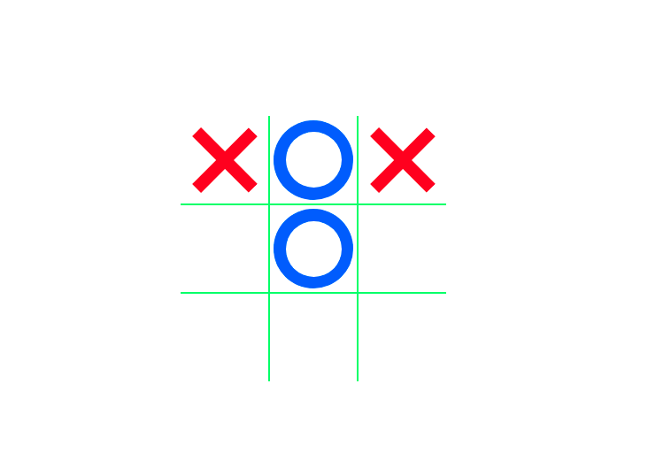

# Tic-Tac-Toe

#Learned:

- (3n + 1) & (3n + 3) to remove left and right side border of game board,
- :not(),
- ES6,
- Template literals

## Built With

- HTML
- CSS
- JS

### Usage

[Live Demo Link](https://ramon-carrillo.github.io/Tic-Tac-Toe/)

## Author

👤 Ramon Carrillo

- GitHub: [@githubhandle](https://github.com/Ramon-Carrillo)
- Twitter: [@twitterhandle](https://twitter.com/ramon_de_NL)
- LinkedIn: [linkedin](https://www.linkedin.com/in/ramon-carrillo-54525a1ab/)

## Show your support

Give a ⭐️ if you like this project!

